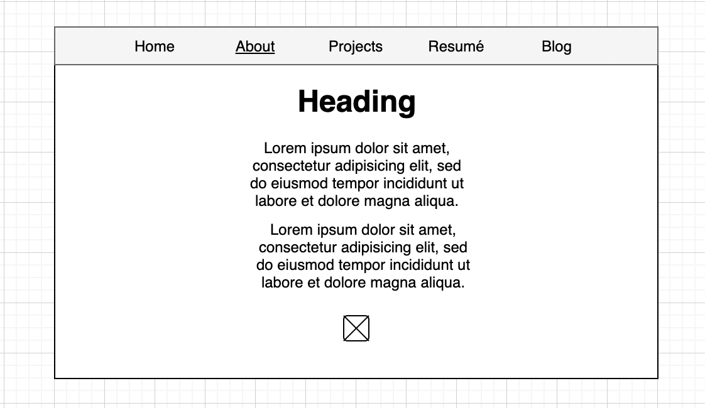

README.md

# portfolio
# Personal Portofolio - Natalia Chamon
## Website Link
The link to my site is found here:  
## GitHub Repo
Link to GitHub repo: https://github.com/nataliack/portfolio
## Purpose 
The purpose of this project is to create a website that showcases my level of ability to code and allows potential employers to view my work. 
At the same time, my webpage will also be like a personal page talking a bit about myself such as hobbies or projects I've done in the past. 
## Functionality + Features
This is going to be a basic personal portfolio/website consisting of 5 html documents and 5 blog posts. 
At the top of every page on the website is a navigation bar allowing users to choose which page they want to go on. A feature added in the navigation bar is hover effect that changes colour from a cream white to a nude pink. Below the navigation bar is a heading with the same settings on every page. An animation effect was added to make a cool complimentary feature. The animation is a glowing effect that slowly lights up like a neon light and it glows to a certain level of brightness and then switches off again and this goes on infinite repeat. 

The functionality on the home page has my name along with some of my contact info that takes users to either my github or to mail me; and the features involved on the home page are icons used from font awesome used to show the app icons of the socials.   

In the about page is a bit about myself as well as my contact info again. The layout of this page is similar to the home page. 

On the projects page is is similar info to the others in order to maintain smooth cohesive visuals so everything looks well combined. An slightly different feature on this page is the video added below, showcasing a cube dodge game that I made a while ago.

I kept the resumé page pretty simple like in the homepage, however on this page there was a pdf file linked, showing the actual resumé.

On the final blog page I placed five blog posts with five images, one for each blog post. On the main blog page there are short previews for each articles and if a user wants to read more, they can click "read more" and they will be taken to another page which will show more info on the article 

## Sitemap 

## Screenshots (process)
Inspo (links): 
- https://codepen.io/elisabethdiang/pen/RwNXxyq 
- https://www.pinterest.com.au/nataliachamom/portfolio-website-inspo/ 

Prototypes:

Wireframes:

## Target Audience 
Target audience for the profile website will be employers, recruiters, colleagues and others involved in the tech industry. 

## Tech Stack 
Website was developed using:
- HTML
- CSS
- SCSS/SASS
- Font Awesome (used along with cdnjs)
- draw.io
- GitHub pages
